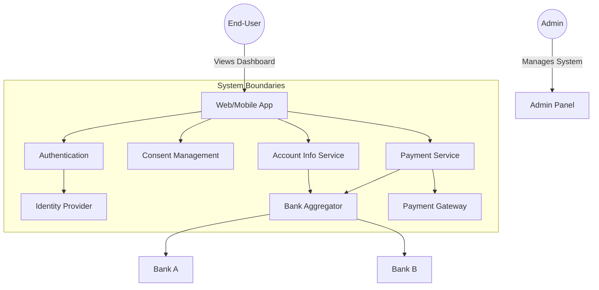

# Software Requirements Specification (SRS)
## for
# OpenBank X - Open Banking Platform

**Version 1.0**

**Prepared for:**
[Your Company Name]

**Prepared by:**
[Your Name/Team Name]

**Date:** October 26, 2023

---

## Table of Contents

1. [Introduction](#1-introduction)
   - 1.1. Purpose
   - 1.2. Document Conventions
   - 1.3. Intended Audience
   - 1.4. Product Scope
   - 1.5. Definitions and Abbreviations
   - 1.6. References
2. [General Description](#2-general-description)
   - 2.1. Product Perspective
   - 2.2. Product Vision and Objectives
   - 2.3. User Characteristics and Personas
   - 2.4. Operating Environment
   - 2.5. Design and Implementation Constraints
   - 2.6. Assumptions and Dependencies
3. [Specific Requirements](#3-specific-requirements)
   - 3.1. System Architecture (High-Level)
   - 3.2. Functional Requirements (Epics, User Stories, AC)
   - 3.3. External Interface Requirements
   - 3.4. Non-Functional Requirements (NFRs)
   - 3.5. Data Requirements (Data Model)
   - 3.6. API Requirements (Internal/External)
4. [Product Evolution (Future Scope)](#4-product-evolution-future-scope)
5. [Appendices](#5-appendices)
   - Appendix A: Use Case Diagrams (Mermaid)
   - Appendix B: Detailed API Specifications

---

## 1. Introduction

### 1.1. Purpose

The purpose of this document is to provide a detailed and comprehensive Software Requirements Specification (SRS) for the **OpenBank X** platform. This document serves as the single source of truth for all stakeholders—including business owners, product managers, software architects, developers, QA engineers, and compliance officers—defining the functional and non-functional requirements of the system. It describes the system's features, its interactions with external entities, and the constraints under which it must operate.

### 1.2. Document Conventions

- **Must, Shall, Should, May:** Key words as defined in RFC 2119.
- **Requirement IDs:** Unique identifiers are used for traceability.
  - `FR-<Epic>-<#>`: Functional Requirement
  - `NFR-<Category>-<#>`: Non-Functional Requirement
  - `DR-<Entity>-<#>`: Data Requirement
- **Acceptance Criteria (AC):** Bulleted or scenario-based conditions that must be met for a user story to be considered complete.

### 1.3. Intended Audience

- **Developers & Architects:** To understand system specifications and constraints.
- **Project Managers:** To plan sprints and allocate resources.
- **QA & Testing Team:** To design test plans and acceptance criteria.
- **Business Stakeholders:** To validate that requirements meet business goals.
- **Compliance & Legal Teams:** To ensure the system meets PSD2, UK Open Banking, and GDPR mandates.

### 1.4. Product Scope

**OpenBank X** is a secure, cloud-native Open Banking platform designed to connect end-users and businesses with their financial data across multiple banks. The platform will function as an **AISP (Account Information Service Provider)** and **PISP (Payment Initiation Service Provider)**.

It will:

- Provide a unified dashboard for users to view aggregated financial data.
- Enable secure initiation of payments directly from the platform.
- Integrate with a TPP (Third Party Provider) aggregator to interface with bank APIs.
- Adhere to strict security standards (OAuth 2.0, OIDC, FAPI).
- Be accessible via Web, iOS, and Android apps.

### 1.5. Definitions and Abbreviations

| Term | Definition |
| :--- | :--- |
| **AISP** | Account Information Service Provider: A TPP that can access account data with user consent. |
| **PISP** | Payment Initiation Service Provider: A TPP that can initiate payments on behalf of the user. |
| **ASPSP** | Account Servicing Payment Service Provider: The bank that holds the user's account. |
| **TPP** | Third Party Provider: A regulated entity providing services to users (e.g., AISP, PISP). |
| **PSD2** | Revised Payment Services Directive (EU Directive 2015/2366) which regulates TPPs. |
| **OB** | Open Banking: The UK-specific standard for open banking APIs. |
| **FAPI** | Financial-grade API (OIDC profile) providing a higher level of security. |
| **OIDC** | OpenID Connect: An identity layer on top of OAuth 2.0. |
| **mTLS** | Mutual Transport Layer Security: Used for client authentication. |
| **Aggregator** | A service (e.g., Plaid, Tink, Salt Edge) that connects to and normalizes data from multiple banks. |
| **Consent** | A data record detailing a user's permission for a TPP to access specific account data or perform specific actions. |
| **MVP** | Minimum Viable Product: The core set of features required for the first release. |
| **SCA** | Strong Customer Authentication: Multi-factor authentication required for sensitive operations. |
| **IdP** | Identity Provider: The service that authenticates and manages user identities (e.g., Auth0, Keycloak). |

### 1.6. References

- **PSD2 Directive:** Directive (EU) 2015/2366.
- **Open Banking UK Standards:** API Specifications.
- **FDX API Specifications:** Financial Data Exchange API.
- **OAuth 2.0:** RFC 6749.
- **OpenID Connect:** Core 1.0.
- **FAPI:** Financial-grade API Security Profile.
- **IEEE 830:** IEEE Recommended Practice for Software Requirements Specifications.

---

## 2. General Description

### 2.1. Product Perspective

The **OpenBank X** system is a modern web application that sits as a TPP in the financial ecosystem. It connects to ASPSPs (via an aggregator), an internal Identity Provider, and a Payment Gateway.

### 2.2. Product Vision and Objectives

- **Vision:** To empower users with full control and a holistic view of their finances, enabling smarter spending decisions through secure, transparent, and seamless open banking.
- **Objectives:**
  1. **Simplicity:** Provide a seamless and intuitive user experience for connecting bank accounts and making payments.
  2. **Security:** Ensure the highest level of security for all financial data in accordance with PSD2 and regional standards.
  3. **Transparency:** Provide users with complete visibility and control over their consents.
  4. **Scalability:** Build a platform capable of handling millions of users and thousands of API requests per second.
  5. **Compliance:** Achieve full compliance with PSD2, UK Open Banking, and GDPR to operate in the EU/UK markets.

### 2.3. User Characteristics and Personas

| Persona | Description | Use Cases |
| :--- | :--- | :--- |
| **End-User (Retail)** | A regular customer who wants to manage personal finances. | View balances; aggregate accounts; categorize transactions; make payments. |
| **End-User (SME)** | A business owner who wants to manage business cash flow. | View multiple business accounts; initiate bulk payroll or supplier payments; reconcile transactions. |
| **Compliance/Admin** | Internal staff responsible for ensuring system compliance and integrity. | Audit logs; user management; system monitoring; manage TPP credentials. |

### 2.4. Operating Environment

- **Hardware:** The system will be deployed on a cloud infrastructure (e.g., AWS, GCP, Azure).
- **OS:** Linux-based server environment.
- **Client:** Modern web browsers (Chrome, Firefox, Safari, Edge) and native iOS/Android applications.
- **Network:** Reliable internet connection required for access.

### 2.5. Design and Implementation Constraints

- **Technology Stack:** The backend will use Java/Spring Boot or Node.js/Express. The frontend will be built using React or Angular. Native apps will use Kotlin (Android) and Swift (iOS).
- **Regulatory:** Must store user data within the EU (GDPR compliance).
- **Security:** All user data at rest and in transit must be encrypted.
- **IDP:** Must integrate with an OIDC-compliant Identity Provider.

### 2.6. Assumptions and Dependencies

- **Assumptions:**
  - Users have a valid bank account at a supported ASPSP.
  - Users have a device with an active internet connection.
- **Dependencies:**
  - **(MVP)** Functional integration with a 3rd-party aggregator (e.g., Plaid/Tink) is critical.
  - **(MVP)** An external IdP solution will be used for authentication.
  - **(Post-MVP)** Direct API integration with specific large banks is a future feature.

---

## 3. Specific Requirements

### 3.1. System Architecture (High-Level)

The system follows a microservices-based architecture. All external communication happens via secure APIs.

```mermaid
graph TD
    subgraph Client Layer
        Web[Web App] --> API_GW
        Mobile[iOS/Android] --> API_GW
    end

    subgraph API Layer
        API_GW[API Gateway] --> Auth_MS[Auth Service]
        API_GW --> Consent_MS[Consent Service]
        API_GW --> Account_MS[Account & Data Service]
        API_GW --> Payment_MS[Payment Service]
        API_GW --> Notification_MS[Notification Service]
        API_GW --> Audit_MS[Audit Service]
    end

    subgraph Core Services
        Auth_MS --> IdP[Identity Provider (OIDC)]
        Consent_MS --> DB[(Database)]
        Account_MS --> Aggregator[Bank Aggregator API]
        Payment_MS --> Aggregator
    end

    subgraph External Systems
        Aggregator --> ASPSP_1[Bank A]
        Aggregator --> ASPSP_2[Bank B]
        Aggregator --> ASPSP_N[Bank N]
        Payment_MS --> P_GW[Payment Gateway]
    end

    style API_GW fill:#f9f,stroke:#333,stroke-width:2px
```

### 3.2. Functional Requirements

This section details the functional requirements using an Epic/User Story/Acceptance Criteria format.

---

#### Epic 1: User Onboarding & Authentication

**Description:** The ability for a user to create an account, log in, and securely authenticate themselves.

##### User Story 1.1: User Registration

- As a **new user**, I want to **register for the OpenBank X platform** so that I can access its services.
- **FR-AUTH-01: User Registration**
  - **Acceptance Criteria:**
    - The system SHALL provide a registration form requiring first name, last name, email, and a strong password.
    - The system SHALL validate email format and password strength.
    - The system MUST send a verification email to confirm the user's identity.
    - The system MUST not allow duplicate email registrations.
    - *(Future)* The system SHOULD allow Social Login (Google/Apple) registration.

##### User Story 1.2: User Login

- As a **registered user**, I want to **log in** securely so that I can access my dashboard.
- **FR-AUTH-02: User Authentication**
  - **Acceptance Criteria:**
    - The system SHALL support login via email/password using OIDC.
    - The system MUST enforce Multi-Factor Authentication (MFA) for critical actions (e.g., Payment) as mandated by PSD2 SCA.
    - The system SHALL implement a "Forgot Password" flow.

---

#### Epic 2: Bank & Account Management

**Description:** The process of linking a user's external bank accounts to the platform.

##### User Story 2.1: Discover and Connect Bank

- As a **user**, I want to **search for and connect my bank account** so that I can start viewing my financial data.
- **FR-BANK-01: Bank Discovery**
  - **AC:** The system SHALL provide a search bar or list of supported banks.
  - **AC:** *(Post-MVP)* The system SHOULD auto-detect the bank based on the user's location.
- **FR-BANK-02: Bank Connection**
  - **AC:** The system SHALL use OAuth 2.0/OIDC to redirect the user to their bank's (or aggregator's) login page.
  - **AC:** Upon successful authentication, the system SHALL receive an authorization code to exchange for access tokens.
  - **AC:** The system MUST store the `access_token` and `refresh_token` securely for the bank connection.

##### User Story 2.2: Account Linking

- As a **user**, I want to **select which of my accounts** to link to the platform.
- **FR-BANK-03: Account Selection**
  - **AC:** The system SHALL display a list of all accounts available at the chosen bank.
  - **AC:** The user MUST be able to select/unselect individual accounts to link.
  - **AC:** The system MUST only request permission for the selected accounts.

---

#### Epic 3: Account Information Services (AIS)

**Description:** Providing users with access to their account data.

##### User Story 3.1: View Account Balances

- As a **user**, I want to **see the current balance** of all my linked accounts on a single dashboard.
- **FR-AIS-01: Balance Inquiry**
  - **AC:** The system SHALL fetch and display the current balance for each linked account.
  - **AC:** The balance SHALL be updated in real-time or at a maximum delay of 15 minutes.

##### User Story 3.2: View Transaction History

- As a **user**, I want to **view my transaction history** to track my spending.
- **FR-AIS-02: Transaction Listing**
  - **AC:** The system SHALL display a list of recent transactions with date, amount, description, and merchant.
  - **AC:** The system MUST support pagination and date-range filtering.
  - **AC:** The system SHOULD attempt to categorize the transaction (e.g., Groceries, Entertainment).

---

#### Epic 4: Payment Initiation Services (PIS)

**Description:** Allowing users to initiate payments directly from the platform.

##### User Story 4.1: Initiate a Single Payment

- As a **user**, I want to **make a payment** to another account directly from my dashboard.
- **FR-PIS-01: Payment Creation**
  - **AC:** The system SHALL provide a payment form requesting: debit account, amount, currency, and beneficiary details (name, IBAN/Account#).
  - **AC:** The system MUST trigger SCA before submitting the payment.
- **FR-PIS-02: Payment Authorization**
  - **AC:** The system SHALL redirect the user to their bank (or aggregator) to authorize the payment.
  - **AC:** The system SHALL handle a callback to receive the final authorization status of the payment.

##### User Story 4.2: Check Payment Status

- As a **user**, I want to **check the status** of my initiated payments.
- **FR-PIS-03: Payment Status**
  - **AC:** The system SHALL display a list of all past payments with their current status (e.g., Pending, Completed, Failed).
  - **AC:** The system MUST allow users to query a specific payment by ID for its full status.

---

#### Epic 5: Consent Management

**Description:** Enabling users to grant, view, and revoke permissions given to the platform.

##### User Story 5.1: Grant Consent

- As a **user**, I want to **understand and grant consent** for data access and payment services.
- **FR-CONS-01: Consent Request**
  - **AC:** Before linking a bank, the system SHALL present a clear and concise "Consent Dashboard" showing exactly what data (Account info, Payments) will be accessed and for how long.
  - **AC:** The system MUST use explicit user action (e.g., "I Agree" button) to record the consent.

##### User Story 5.2: View and Revoke Consent

- As a **user**, I want to **view active consents and revoke them** at any time.
- **FR-CONS-02: Consent Management**
  - **AC:** The system SHALL have a "Settings" -> "Connected Apps" page.
  - **AC:** The system MUST list all active consents for the user.
  - **AC:** The user SHALL be able to select a consent and "Revoke" it.
  - **AC:** Upon revocation, the system MUST notify any external systems (e.g., Aggregator) to stop data access.

---

#### Epic 6: Notifications & Alerts

**Description:** Informing users about important events within the system.

##### User Story 6.1: Receive Event Notifications

- As a **user**, I want to **receive notifications** about payment status changes or consent expiry.
- **FR-NOT-01: Notifications**
  - **AC:** The system SHALL send an in-app notification when a payment status is updated (e.g., from Pending to Completed).
  - **AC:** The system MUST send an email alert when a consent is about to expire (e.g., 7 days and 1 day before expiry).
  - **AC:** The user SHALL be able to configure their notification preferences.

---

#### Epic 7: Audit & Compliance

**Description:** Logging all critical actions for regulatory compliance.

##### User Story 7.1: Log User Actions

- As a **Compliance Officer**, I want to **see a detailed log** of all user and system activity.
- **FR-AUD-01: Audit Logging**
  - **AC:** The system SHALL log all user logins, consent grants, payments initiated, and data access requests.
  - **AC:** Logs MUST be immutable and stored for a minimum of 5 years (PSD2 requirement).
  - **AC:** Each log entry MUST contain: Timestamp, User ID, Action Type, Source IP, and Outcome.

---

### 3.3. External Interface Requirements

#### 3.3.1. User Interfaces (UI)

- **Web:** Must be responsive, designed for all screen sizes.
- **Native:** Must follow OS-specific design guidelines (Material Design for Android, HIG for iOS).
- **Accessibility:** Must comply with WCAG 2.1 AA standards.
- **Language:** Support English initially; MVP to use a static language.

#### 3.3.2. Hardware Interfaces

None specified.

#### 3.3.3. Software Interfaces (APIs, Aggregators)

- **Bank Aggregator API:**
  - The system MUST integrate with a TPP aggregator (e.g., Plaid, Tink, Salt Edge) for bank connectivity in the MVP.
  - The system will use the aggregator's unified API to authenticate, retrieve accounts, fetch balances/transactions, and initiate payments.
- **Identity Provider (IdP):**
  - The system MUST integrate with Auth0 or a similar OIDC-compliant service.
- **Payment Gateway:**
  - Necessary for handling payments where a direct ASPSP connection is not available (optional).

#### 3.3.4. Communication Interfaces

- **Protocol:** All external communications MUST use HTTPS (TLS 1.2/1.3).
- **API Style:** RESTful APIs using JSON for request/response bodies.
- **Authentication:** OAuth 2.0 with OIDC and FAPI compliance.

### 3.4. Non-Functional Requirements (NFRs)

#### 3.4.1. Performance & Scalability (NFR-PERF)

- **Response Time:** 95% of API requests SHALL respond in under 200ms.
- **Throughput:** The system MUST support 100 concurrent users per microservice instance.
- **Scalability:** The system architecture SHALL be horizontally scalable.
- **Data Caching:** Results from aggregator APIs SHALL be cached to reduce latency.

#### 3.4.2. Availability & Reliability (NFR-AVAIL)

- **Uptime:** 99.9% uptime measured over a rolling 30-day period.
- **Disaster Recovery:** RPO of 15 minutes, RTO of 1 hour.

#### 3.4.3. Security & Data Privacy (NFR-SEC)

- **Encryption:** Data at rest SHALL be encrypted using AES-256. Data in transit SHALL use TLS 1.2/1.3.
- **Secrets Management:** All secrets SHALL be stored in a secure vault (e.g., HashiCorp Vault, AWS Secrets Manager).
- **Session Management:** User sessions SHALL have a maximum inactive timeout of 15 minutes.
- **PII/Data Privacy:** PII SHALL be obfuscated/pseudonymized in non-production environments. The system MUST comply with GDPR, allowing the user to request data deletion or portability.

#### 3.4.4. Maintainability & Supportability (NFR-MAINT)

- **Logging:** Centralized logging SHALL be implemented using the ELK stack or a similar solution.
- **Monitoring:** Application performance monitoring (APM) SHALL be in place to track service health.
- **Code Quality:** The system SHOULD maintain a test code coverage of >80%.

#### 3.4.5. Regulatory & Compliance (NFR-REG)

- **PSD2 Compliance:** The system MUST implement SCA for payments and sensitive data access.
- **UK Open Banking:** The system MUST adhere to the OIDC/FAPI security profile.
- **Secure Storage:** OAuth tokens SHALL be stored with at-rest encryption.

### 3.5. Data Requirements (Data Model)

The system is built around the following core entities:

#### User
- `userId` (UUID, PK)
- `email` (String, Unique)
- `passwordHash` (String)
- `firstName`, `lastName`
- `profileImageUrl` (String, Optional)
- `createdAt`, `updatedAt` (Timestamp)

#### Consent
- `consentId` (UUID, PK)
- `userId` (UUID, FK to User)
- `bankConnectionId` (UUID, FK to BankConnection)
- `status` (Enum: ACTIVE, REVOKED, EXPIRED)
- `scopes` (JSON/List of Strings: e.g., 'accounts.read', 'payments.write')
- `expiresAt` (Timestamp)
- `createdAt`, `updatedAt`

#### BankConnection
- `bankConnectionId` (UUID, PK)
- `userId` (UUID, FK to User)
- `provider` (Enum: PLAID, TINK, SALT_EDGE, DIRECT)
- `externalConnectionId` (String from aggregator)
- `accessToken` (String, Encrypted)
- `refreshToken` (String, Encrypted)
- `status` (Enum: ACTIVE, EXPIRED, INVALID)
- `createdAt`, `updatedAt`

#### Account
- `accountId` (UUID, PK)
- `bankConnectionId` (UUID, FK)
- `externalAccountId` (String)
- `name` (String)
- `type` (Enum: CHECKING, SAVINGS, CREDIT, INVESTMENT)
- `currency` (String)
- `balance` (Double/Decimal)
- `createdAt`, `updatedAt`

#### Transaction
- `transactionId` (UUID, PK)
- `accountId` (UUID, FK)
- `externalTransactionId` (String)
- `amount` (Decimal)
- `currency` (String)
- `description` (String)
- `category` (String, e.g., 'Groceries')
- `transactionDate` (Timestamp)
- `createdAt`, `updatedAt`

#### Payment
- `paymentId` (UUID, PK)
- `userId` (UUID, FK)
- `fromAccountId` (UUID, FK)
- `amount` (Decimal)
- `currency` (String)
- `beneficiaryName` (String)
- `beneficiaryAccount` (String)
- `reference` (String)
- `status` (Enum: PENDING, COMPLETED, FAILED)
- `createdAt`, `updatedAt`

#### AuditLog
- `auditLogId` (UUID, PK)
- `userId` (UUID, FK)
- `action` (String, e.g., 'PAYMENT_INITIATED', 'CONSENT_REVOKED')
- `ipAddress` (String)
- `details` (JSON Blob)
- `timestamp` (Timestamp)

### 3.6. API Requirements

The platform will expose an internal RESTful API for the client applications. Below is a high-level representation.

| Endpoint Group | Method & Path | Description | Auth | Request Body Example | Response Example |
| :--- | :--- | :--- | :--- | :--- | :--- |
| **Authentication** | `POST /api/auth/login` | Authenticate user. | None | `{ "email": "...", "password": "..." }` | `{ "access_token": "...", "token_type": "Bearer", "expires_in": 3600 }` |
| **Banks** | `GET /api/banks` | Get list of supported banks. | Bearer Token | N/A | `[ { "id": "bank_1", "name": "Chase" }, ... ]` |
| **Banks** | `POST /api/banks/connect` | Initiate OAuth flow with aggregator/bank. | Bearer Token | `{ "bankId": "bank_1", "redirect_uri": "..." }` | `{ "auth_url": "https://bank.com/login", "session_id": "..." }` |
| **Accounts** | `GET /api/accounts` | Get all linked accounts for the user. | Bearer Token | N/A | `[ { "id": "acc_1", "name": "Personal Checking", "balance": 1000.00, "currency": "USD" }, ... ]` |
| **Transactions** | `GET /api/accounts/{accountId}/transactions` | Get transactions for an account. | Bearer Token | `?limit=20&offset=0&date_from=2023-01-01` | `[ { "id": "txn_1", "amount": -30.50, "description": "Netflix", "category": "Entertainment", "date": "2023-10-20" } ]` |
| **Payments** | `POST /api/payments` | Initiate a new payment. | Bearer Token | `{ "fromAccountId": "acc_1", "amount": 100, "currency": "USD", "beneficiary": { "name": "John Doe", "account": "123456789" } }` | `{ "paymentId": "pay_123", "status": "PENDING", "approval_url": "..." }` |
| **Payments** | `GET /api/payments/{paymentId}` | Get a payment status. | Bearer Token | N/A | `{ "paymentId": "pay_123", "status": "COMPLETED", "statusDetail": "..." }` |
| **Consents** | `GET /api/consents` | Get active consents for the user. | Bearer Token | N/A | `[ { "consentId": "con_1", "scope": ["accounts.read"], "expiresAt": "2024-01-01T00:00:00Z" } ]` |
| **Consents** | `DELETE /api/consents/{consentId}` | Revoke an active consent. | Bearer Token | N/A | `{ "success": true }` |

#### Error Handling

- All API errors MUST conform to a standard JSON format.
  ```json
  {
      "timestamp": "2023-10-26T10:00:00Z",
      "status": 400,
      "error": "Bad Request",
      "message": "Invalid account ID provided.",
      "path": "/api/payments"
  }
  ```
- The system SHALL handle standard HTTP status codes: `200 OK`, `201 Created`, `400 Bad Request`, `401 Unauthorized`, `403 Forbidden`, `404 Not Found`, `500 Internal Server Error`.

---

## 4. Product Evolution (Future Scope)

- **Credit Card Management:** Direct management of credit card accounts (like the legacy system but using Open Banking APIs).
- **Advanced Analytics:** Cash flow predictions, automated budgeting, and personalized financial advice.
- **Merchant Loyalty Integration:** Automatically apply loyalty rewards during payments.
- **Direct Bank Integration:** Move away from the aggregator and implement direct integrations with major banks (e.g., HSBC, Barclays) to reduce costs and latency.
- **Variable Recurring Payments:** Support for recurring payments with limits (VRP as per UK Open Banking).

---

## 5. Appendices

### Appendix A: Use Case Diagram (Mermaid)



### Appendix B: Detailed API Specifications

While the core API endpoints are listed in section 3.6, a full, production-grade specification would be provided via OpenAPI (Swagger) as a separate document.

---

**END OF DOCUMENT**